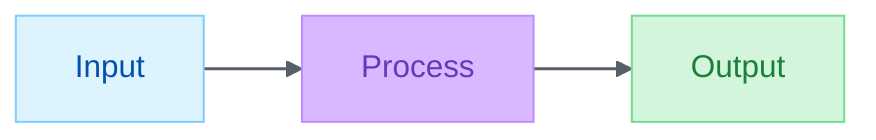

# Markdown & Mermaid

## Muse delta

- **Native to Muse:** generating syntactically correct Mermaid. LLMs produce valid diagrams natively.
- **What this skill uniquely adds:** (1) the project's **init directive + linkStyle + classDef vocabulary** (from `.github/config/brand-palette.json`), and (2) the **renderer-specific pitfalls** below — colons breaking timeline/gitGraph/gantt parsers, unicode escapes, `<br/>` vs `\n` — that native generation reliably trips on.
- **Load when:** embedding Mermaid in markdown, debugging a silent render failure, or choosing between Mermaid / D2 / PlantUML / Excalidraw.

Unified 2026-07-30: palette values moved from the retired `mermaid-init.json` into the shared `brand-palette.json`. One file, all visual layers.

## Init directive (always required)

Every diagram starts with an init directive derived from `.github/config/brand-palette.json`: `themeVariables` from `brand` (edgeLabelBackground = white constant), `classDef`s from `semantic`, `linkStyle` from `typography.linkStroke` / `linkStrokeWidth`. Default (Alex ACT 6-role semantic palette):

````markdown

````

To override the palette for a project, edit `.github/config/brand-palette.json` (rebrands mermaid + the illustrator plugin's svg-banner + illustrator + flint at once). For one diagram only, override the init directive inline (rare).

## Semantic classDef vocabulary

Apply `:::<class>` to every node:

| Class        | Role                              | Example                 |
| ------------ | --------------------------------- | ----------------------- |
| `:::blue`    | Input, source, start              | `A[Audio file]:::blue`  |
| `:::green`   | Output, result, success           | `C[Transcript]:::green` |
| `:::purple`  | Processing, model, transformation | `B[WhisperX]:::purple`  |
| `:::gold`    | Decision, condition, gate         | `D{Valid?}:::gold`      |
| `:::red`     | Error, warning, failure           | `E[Retry]:::red`        |
| `:::neutral` | Context, optional, out-of-scope   | `F[Cache]:::neutral`    |

Consistency across the fleet matters more than per-diagram creativity.

## Mode fragility (renderer footguns)

| Mode              | Status  | Constraint                               |
| ----------------- | ------- | ---------------------------------------- |
| `flowchart`       | Safe    | None — handles any content               |
| `sequenceDiagram` | Safe    | Standard message format                  |
| `classDiagram`    | Safe    | Standard notation                        |
| `erDiagram`       | Safe    | Standard notation                        |
| `stateDiagram`    | Caution | Colons in state names break parsing      |
| `journey`         | Caution | Score format is sensitive                |
| `timeline`        | Fragile | Colons in events (`:` is separator)      |
| `gitGraph`        | Fragile | Long chains with quoted colon-tags break |
| `gantt`           | Fragile | `dateFormat HH:mm` mis-parses task lines |

**Rule:** if labels contain colons, times (`HH:MM`), or complex text — use `flowchart` with subgraphs. **Debug silent failure:** check console, simplify content, test incrementally, try `flowchart`.

Full pitfall catalog (P1–P9, unicode/emoji failures, layout patterns, reserved words, cross-diagram compatibility) in [`references/pitfalls.md`](references/pitfalls.md).

## Multi-line labels

Use `<br/>`, **NOT** `\n`. `\n` renders as literal text — the single most common defect in LLM-generated Mermaid.

## Diagram-tool selection

| Showing                          | Best tool                               | Why                                  |
| -------------------------------- | --------------------------------------- | ------------------------------------ |
| Process, workflow, decision tree | Mermaid flowchart                       | Native GitHub, wide renderer support |
| System architecture (technical)  | Mermaid flowchart + subgraphs           | Same                                 |
| System architecture (executive)  | D2 (external)                           | Cleaner, less busy                   |
| Sequence / API interactions      | Mermaid sequenceDiagram                 | Native                               |
| Class relationships              | Mermaid classDiagram                    | Native                               |
| Timeline / roadmap               | Mermaid gantt (but see fragility above) | Native but fragile                   |
| Free-form / whiteboard           | Excalidraw (external)                   | LLM cannot generate; user draws      |
| Data / metrics                   | flint-chart plugin                      | Real chart rendering, not diagram    |
| Brand / hero banner              | [`svg-banner`](../svg-banner/SKILL.md)   | Not a diagram; different domain      |

For Mermaid alternatives (D2, PlantUML, Graphviz, WaveDrom) with syntax examples, see [`references/tool-ecosystem.md`](references/tool-ecosystem.md).

## References

- [`references/pitfalls.md`](references/pitfalls.md) — parser pitfalls P1–P9, unicode/emoji, reserved words, cross-diagram compatibility
- [`references/tool-ecosystem.md`](references/tool-ecosystem.md) — Mermaid / D2 / PlantUML / Excalidraw comparison
- [`references/diagram-reference.md`](references/diagram-reference.md) — diagram types, node shapes, edge styles, per-diagram theming
- [`references/markdown-best-practices.md`](references/markdown-best-practices.md) — document structure, figure/table conventions

## Related

- [`lint-clean-markdown`](../lint-clean-markdown/SKILL.md) — when the concern is lint compliance rather than diagram rendering
